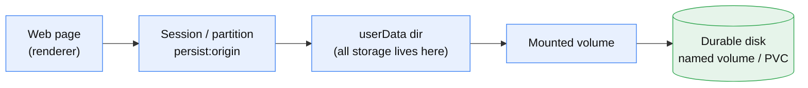
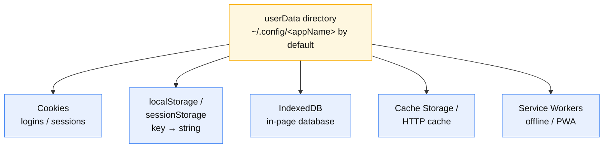
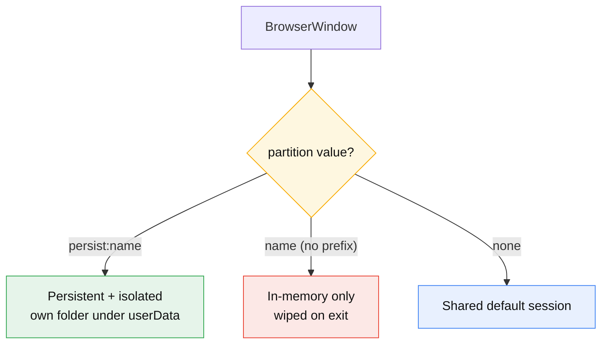
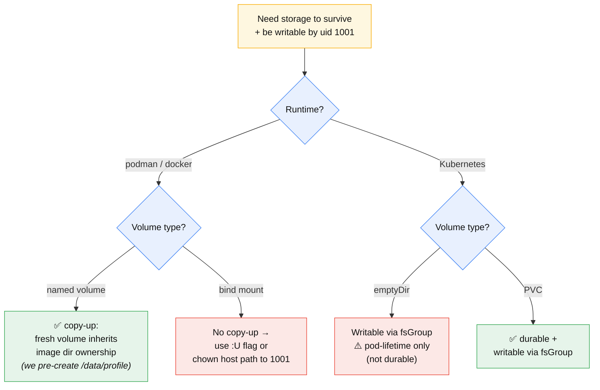

# Electron Web Storage — Field Guide

How this app stores web data, how it's kept across container recreation, and the
vocabulary to discuss it. Scoped to `electron-gpu-test` (Electron 41 / Chromium
146, non-root `app` user, uid 1001).

---

## 1. The big picture

Everything a web page saves is just **files in one directory**. The chain from a
running page down to durable disk:



If the last link is a throwaway container layer, everything resets each run
(logged out, cold cache). If it's a **named volume** or **PVC**, it persists.

---

## 2. What's inside `userData` (the kinds of storage)



| Term | Purpose | Lifetime |
|------|---------|----------|
| **Cookies** | Small values sent to the server each request; logins live here | Until expiry / cleared |
| **localStorage** | Simple `key → string` the page's JS reads/writes | Persistent |
| **sessionStorage** | Same API, but per-tab | Dies with the tab |
| **IndexedDB** | A real in-browser database for larger data | Persistent |
| **Cache Storage / HTTP cache** | Cached fetched files; service workers use it for offline | Persistent |
| **Service Workers** | Background scripts enabling offline/PWA behavior | Persistent |

---

## 3. Sessions & partitions

A **session** (aka **partition**) is Electron's handle to one storage bucket.
Each `BrowserWindow` picks one via `webPreferences.partition`.



**This app** keys each window's partition by **origin** (`persist:<proto>-<host>`),
so different sites can't read each other's cookies/storage and each remembers its
own login independently.

---

## 4. Persistence & the ownership gotcha

Two separate problems: **(a)** make storage survive container recreation, and
**(b)** make the volume writable by the non-root `app` user (uid 1001).



### Key terms

- **Ephemeral container** — its filesystem is discarded on recreation; anything
  not on a volume is lost.
- **Named volume** — storage the runtime keeps independently and re-attaches next
  run. What you want for persistence.
- **Bind mount** — a host directory mapped in; keeps the host's ownership.
- **Copy-up** — podman/docker behavior: a *fresh, empty* named volume inherits
  the image directory's contents/ownership. That's why the image pre-creates
  `/data/profile` owned by `app`. **Named volumes only** — bind mounts don't do
  this.
- **`fsGroup`** (Kubernetes `securityContext`) — kubelet chowns the volume to
  that group so a non-root pod can write. The k8s equivalent of copy-up.
- **`emptyDir` vs PVC** — `emptyDir` lives only as long as the pod on its node
  (survives container restarts, not rescheduling). A **PVC** is durable.

---

## 5. Cheat sheet

| Path | Make writable by uid 1001 | Persists across recreation? |
|------|---------------------------|-----------------------------|
| podman/docker **named volume** | copy-up (pre-created dir in image) | ✅ Yes |
| podman/docker **bind mount** | `:U` flag / host `chown` | ✅ Yes |
| k8s **`emptyDir`** | `securityContext.fsGroup` | ❌ Pod-lifetime only |
| k8s **PVC** | `securityContext.fsGroup` | ✅ Yes |

### This app's knobs

- `ELECTRON_USER_DATA` — set it to relocate `userData` onto a mounted path
  (unset → default `~/.config/electron-gpu-test`, discarded with the container).
- Image pre-creates `/data/profile` (owner `app`, mode `0700`) so a fresh named
  volume there is writable with no extra flags.
- `launch.sh` fails fast with a fix-it message if the storage path isn't writable.

### Run it (podman, persistent)

```sh
podman run --rm --device nvidia.com/gpu=all \
  -e OZONE=x11 -e DISPLAY="$DISPLAY" \
  -v /tmp/.X11-unix:/tmp/.X11-unix:ro \
  -v "$XAUTHORITY":/home/app/.Xauthority:ro -e XAUTHORITY=/home/app/.Xauthority \
  -e ELECTRON_USER_DATA=/data/profile \
  -v electron-profile:/data/profile \
  electron-gpu-test https://webrtc.github.io/samples/
```

> **Note:** web storage (this doc) is separate from the **TLS trust store**
> (`~/.pki/nssdb`), which `setup-certs.sh` rebuilds from mounted PEMs each launch.

---

## 6. Vocabulary to carry a conversation

**userData** · **session / partition (`persist:`)** · **named volume vs bind
mount** · **copy-up** · **`fsGroup`** · **`emptyDir` vs PVC** · **ephemeral
container**
